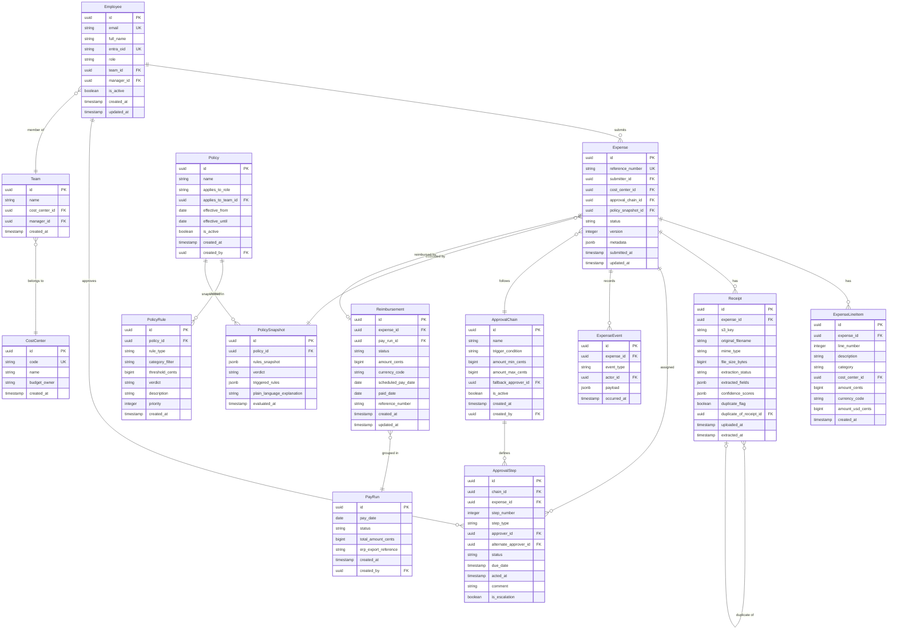

# Data Model — Expense Management & Reimbursement Platform

> **Traceability:** REQ-EXP-1 (Expense, Receipt, ExpenseLineItem) · REQ-EXP-2 (ApprovalChain, ApprovalStep, ExpenseEvent) · REQ-EXP-3 (Policy, PolicyRule) · REQ-EXP-4 (Reimbursement, ExpenseEvent) · REQ-EXP-5 (analytics views) · REQ-AUTH-1 (Employee, Team, CostCenter)

---

## 1. Entity Relationship Diagram



---

## 2. Data Dictionary

### Employee

| Column | Type | Constraints | Description |
|--------|------|-------------|-------------|
| `id` | UUID | PK | Stable internal identifier |
| `email` | VARCHAR(255) | UNIQUE NOT NULL | Corporate email address |
| `full_name` | VARCHAR(255) | NOT NULL | Display name |
| `entra_oid` | VARCHAR(128) | UNIQUE NOT NULL | Microsoft Entra Object ID — used for SSO token matching |
| `role` | VARCHAR(50) | NOT NULL | One of: `employee`, `approver`, `finance`, `admin` |
| `team_id` | UUID | FK → Team | Organisational team membership |
| `manager_id` | UUID | FK → Employee (self) | Direct reporting manager; nullable for top-level employees |
| `is_active` | BOOLEAN | DEFAULT TRUE | Soft-delete flag; inactive accounts cannot log in |
| `created_at` | TIMESTAMPTZ | NOT NULL | Record creation timestamp |
| `updated_at` | TIMESTAMPTZ | NOT NULL | Last-modified timestamp |

**RLS policy:** `employee` role sees only own row; `finance`/`admin` see all.

---

### Team

| Column | Type | Constraints | Description |
|--------|------|-------------|-------------|
| `id` | UUID | PK | Stable identifier |
| `name` | VARCHAR(255) | NOT NULL | Display name (e.g., "Engineering - Q2") |
| `cost_center_id` | UUID | FK → CostCenter | Default cost centre for the team |
| `manager_id` | UUID | FK → Employee | Team's designated manager |
| `created_at` | TIMESTAMPTZ | NOT NULL | Record creation timestamp |

---

### CostCenter

| Column | Type | Constraints | Description |
|--------|------|-------------|-------------|
| `id` | UUID | PK | Stable identifier |
| `code` | VARCHAR(50) | UNIQUE NOT NULL | GL code (e.g., `ENG-Q2-2026`) |
| `name` | VARCHAR(255) | NOT NULL | Friendly name |
| `budget_owner` | VARCHAR(255) | | Responsible person name |
| `created_at` | TIMESTAMPTZ | NOT NULL | Record creation timestamp |

---

### Expense

| Column | Type | Constraints | Description |
|--------|------|-------------|-------------|
| `id` | UUID | PK | Stable identifier |
| `reference_number` | VARCHAR(32) | UNIQUE NOT NULL | Human-readable ID (e.g., `EXP-2026-0047`) |
| `submitter_id` | UUID | FK → Employee NOT NULL | Who submitted the expense |
| `cost_center_id` | UUID | FK → CostCenter | Primary cost centre (overridden per line item) |
| `approval_chain_id` | UUID | FK → ApprovalChain | Chain assigned at submission time; immutable after |
| `policy_snapshot_id` | UUID | FK → PolicySnapshot | Policy state at time of submission; immutable |
| `status` | VARCHAR(50) | NOT NULL | See state machine below |
| `version` | INTEGER | NOT NULL DEFAULT 0 | Optimistic lock counter; incremented on every state change |
| `metadata` | JSONB | | Flexible bag: duplicate_flag, manual_entry_flag, etc. |
| `submitted_at` | TIMESTAMPTZ | | Nullable until first submission |
| `updated_at` | TIMESTAMPTZ | NOT NULL | Last-modified timestamp |

**Expense status state machine:**

```
draft → submitted → in_approval → approved_final → reimbursement_initiated → reimbursement_paid
                  ↗ returned_for_edit ←─ in_approval
                  ↘ rejected ←──────────── in_approval
```

**Index:** `(submitter_id, status)`, `(approval_chain_id)`, `(submitted_at DESC)`

---

### ExpenseLineItem

| Column | Type | Constraints | Description |
|--------|------|-------------|-------------|
| `id` | UUID | PK | Stable identifier |
| `expense_id` | UUID | FK → Expense NOT NULL | Parent expense |
| `line_number` | INTEGER | NOT NULL | 1-based ordering within expense |
| `description` | TEXT | | Line item description |
| `category` | VARCHAR(100) | NOT NULL | Expense category (e.g., `meals`, `travel`, `office`) |
| `cost_center_id` | UUID | FK → CostCenter | Overrides expense-level cost centre for this line |
| `amount_cents` | BIGINT | NOT NULL | Amount in original currency (integer cents) |
| `currency_code` | CHAR(3) | NOT NULL | ISO 4217 currency code |
| `amount_usd_cents` | BIGINT | NOT NULL | Normalised USD amount at submission-date FX rate |
| `created_at` | TIMESTAMPTZ | NOT NULL | Record creation timestamp |

**Constraint:** `amount_cents > 0`; `UNIQUE (expense_id, line_number)`

---

### Receipt

| Column | Type | Constraints | Description |
|--------|------|-------------|-------------|
| `id` | UUID | PK | Stable identifier |
| `expense_id` | UUID | FK → Expense NOT NULL | Parent expense |
| `s3_key` | VARCHAR(512) | NOT NULL | S3 object key for the stored file |
| `original_filename` | VARCHAR(255) | | Client-provided filename |
| `mime_type` | VARCHAR(100) | | MIME type (e.g., `image/jpeg`, `application/pdf`) |
| `file_size_bytes` | BIGINT | | File size in bytes; max enforced: 10,485,760 (10 MB) |
| `extraction_status` | VARCHAR(50) | NOT NULL | `pending`, `processing`, `complete`, `failed`, `manual_entry_required` |
| `extracted_fields` | JSONB | | Structured fields from Claude: `{merchant, date, amount, currency, category, line_items[]}` |
| `confidence_scores` | JSONB | | Per-field confidence: `{merchant: 0.87, date: 0.99, ...}` |
| `duplicate_flag` | BOOLEAN | DEFAULT FALSE | Set true if matching receipt detected at submission |
| `duplicate_of_receipt_id` | UUID | FK → Receipt (self) | Reference to the earlier receipt if duplicate |
| `uploaded_at` | TIMESTAMPTZ | NOT NULL | Upload timestamp |
| `extracted_at` | TIMESTAMPTZ | | Extraction completion timestamp |

**Duplicate detection index:** `(expense_id)` — comparison query uses `extracted_fields->>'merchant_normalised'`, `extracted_fields->>'amount_cents'`, `extracted_fields->>'receipt_date'`.

---

### Policy

| Column | Type | Constraints | Description |
|--------|------|-------------|-------------|
| `id` | UUID | PK | Stable identifier |
| `name` | VARCHAR(255) | NOT NULL | Display name |
| `applies_to_role` | VARCHAR(50) | | If set, applies to all users with this role |
| `applies_to_team_id` | UUID | FK → Team | If set, applies to team members only; more specific than role |
| `effective_from` | DATE | NOT NULL | First day policy is active |
| `effective_until` | DATE | | Null = indefinite |
| `is_active` | BOOLEAN | DEFAULT TRUE | Soft-delete flag |
| `created_at` | TIMESTAMPTZ | NOT NULL | |
| `created_by` | UUID | FK → Employee | Admin who created the policy |

---

### PolicyRule

| Column | Type | Constraints | Description |
|--------|------|-------------|-------------|
| `id` | UUID | PK | Stable identifier |
| `policy_id` | UUID | FK → Policy NOT NULL | Parent policy |
| `rule_type` | VARCHAR(100) | NOT NULL | One of: `per_person_max`, `per_trip_max`, `per_diem_max`, `missing_receipt`, `weekend_flag`, `requires_second_approval` |
| `category_filter` | VARCHAR(100) | | Null = applies to all categories |
| `threshold_cents` | BIGINT | | Monetary threshold in USD cents; null for non-monetary rule types |
| `verdict` | VARCHAR(10) | NOT NULL | `pass`, `warn`, or `block` |
| `description` | TEXT | | Admin-readable rule description |
| `priority` | INTEGER | NOT NULL DEFAULT 100 | Lower = evaluated first; used to resolve conflicts |
| `created_at` | TIMESTAMPTZ | NOT NULL | |

---

### PolicySnapshot

| Column | Type | Constraints | Description |
|--------|------|-------------|-------------|
| `id` | UUID | PK | Stable identifier |
| `policy_id` | UUID | FK → Policy NOT NULL | Source policy |
| `rules_snapshot` | JSONB | NOT NULL | Complete copy of PolicyRules at evaluation time |
| `verdict` | VARCHAR(10) | NOT NULL | Aggregate result: `pass`, `warn`, or `block` |
| `triggered_rules` | JSONB | | List of `{rule_id, rule_name, threshold, actual_value, message}` |
| `plain_language_explanation` | TEXT | | AI-generated explanation; empty string if verdict = pass |
| `evaluated_at` | TIMESTAMPTZ | NOT NULL | When evaluation ran |

**Purpose:** Immutable record of what rules were evaluated and the result — supports audit, approver review, and dispute resolution. Referenced by `expenses.policy_snapshot_id`.

---

### ApprovalChain

| Column | Type | Constraints | Description |
|--------|------|-------------|-------------|
| `id` | UUID | PK | Stable identifier |
| `name` | VARCHAR(255) | NOT NULL | Display name |
| `trigger_condition` | VARCHAR(255) | NOT NULL | Human-readable trigger description |
| `amount_min_cents` | BIGINT | | Lower bound of amount trigger range (inclusive) |
| `amount_max_cents` | BIGINT | | Upper bound of amount trigger range (exclusive); null = unbounded |
| `fallback_approver_id` | UUID | FK → Employee NOT NULL | Used when no step approver resolves |
| `is_active` | BOOLEAN | DEFAULT TRUE | Soft-delete flag |
| `created_at` | TIMESTAMPTZ | NOT NULL | |
| `created_by` | UUID | FK → Employee | Admin who created the chain |

---

### ApprovalStep

| Column | Type | Constraints | Description |
|--------|------|-------------|-------------|
| `id` | UUID | PK | Stable identifier |
| `chain_id` | UUID | FK → ApprovalChain NOT NULL | Which chain this step belongs to (template row) |
| `expense_id` | UUID | FK → Expense | Populated when step is instantiated for a specific expense; null for template rows |
| `step_number` | INTEGER | NOT NULL | 1-based ordering; parallel steps share the same `step_number` |
| `step_type` | VARCHAR(20) | NOT NULL | `sequential` or `parallel` |
| `approver_id` | UUID | FK → Employee | Resolved approver; null until chain is instantiated |
| `alternate_approver_id` | UUID | FK → Employee | Self-approval bypass / OOO delegate |
| `status` | VARCHAR(50) | NOT NULL | `pending`, `approved`, `rejected`, `returned_for_edit`, `escalated`, `skipped` |
| `due_date` | TIMESTAMPTZ | | SLA deadline for this step |
| `acted_at` | TIMESTAMPTZ | | When approver took action |
| `comment` | TEXT | | Required on rejection; optional otherwise |
| `is_escalation` | BOOLEAN | DEFAULT FALSE | True if this step was created by SLA escalation |

**Index:** `(expense_id, status)`, `(approver_id, status)` — hot query paths for queue listing.

---

### ExpenseEvent

| Column | Type | Constraints | Description |
|--------|------|-------------|-------------|
| `id` | UUID | PK | Client-generated UUID v4; used as idempotency key |
| `expense_id` | UUID | FK → Expense NOT NULL | Parent expense |
| `event_type` | VARCHAR(100) | NOT NULL | One of: `submitted`, `policy_evaluated`, `submitted_to_approval`, `approved_by_step`, `rejected`, `returned_for_edit`, `resubmitted`, `approved_final`, `reimbursement_initiated`, `reimbursement_paid` |
| `actor_id` | UUID | FK → Employee | Who caused the event; null for system events |
| `payload` | JSONB | | Event-specific data (e.g., `{step_id, comment, policy_verdict}`) |
| `occurred_at` | TIMESTAMPTZ | NOT NULL DEFAULT now() | Event timestamp |

**Constraint:** `UNIQUE (id)` — idempotent insert via `ON CONFLICT (id) DO NOTHING`.

**Append-only rule:** No `UPDATE` or `DELETE` on this table. RLS policy blocks non-`INSERT` DML for the application role.

---

### Reimbursement

| Column | Type | Constraints | Description |
|--------|------|-------------|-------------|
| `id` | UUID | PK | Stable identifier |
| `expense_id` | UUID | FK → Expense UNIQUE NOT NULL | One reimbursement per expense |
| `pay_run_id` | UUID | FK → PayRun | Assigned when included in a pay run |
| `status` | VARCHAR(50) | NOT NULL | `pending`, `in_pay_run`, `paid`, `on_hold` |
| `amount_cents` | BIGINT | NOT NULL | Amount to reimburse in base currency |
| `currency_code` | CHAR(3) | NOT NULL | ISO 4217 |
| `scheduled_pay_date` | DATE | | Predicted / confirmed pay date |
| `paid_date` | DATE | | Actual payment date; set when `status=paid` |
| `reference_number` | VARCHAR(100) | | ERP transaction reference |
| `created_at` | TIMESTAMPTZ | NOT NULL | |
| `updated_at` | TIMESTAMPTZ | NOT NULL | |

---

### PayRun

| Column | Type | Constraints | Description |
|--------|------|-------------|-------------|
| `id` | UUID | PK | Stable identifier |
| `pay_date` | DATE | NOT NULL | Scheduled payment date |
| `status` | VARCHAR(50) | NOT NULL | `draft`, `finalised`, `exported`, `paid` |
| `total_amount_cents` | BIGINT | | Sum of all included reimbursements |
| `erp_export_reference` | VARCHAR(255) | | Reference from ERP system on export |
| `created_at` | TIMESTAMPTZ | NOT NULL | |
| `created_by` | UUID | FK → Employee | Finance user who created the run |

---

## 3. Analytics Views (read-only, used by analytics engine)

```sql
-- Role-scoped spend summary — Finance sees all; Approver sees own team; Employee sees own
CREATE VIEW v_expense_spend_summary AS
SELECT
    e.id,
    e.reference_number,
    e.submitter_id,
    emp.team_id,
    eli.category,
    eli.amount_usd_cents,
    eli.cost_center_id,
    e.status,
    e.submitted_at
FROM expenses e
JOIN expense_line_items eli ON eli.expense_id = e.id
JOIN employees emp ON emp.id = e.submitter_id;
-- RLS on underlying tables enforces row visibility
```

Analytics views are granted to the `analytics_reader` DB role only. The NL query guard executes under this role.

---

## 4. PII & Data Retention Controls

| Entity | PII fields | Retention | Deletion approach |
|--------|-----------|-----------|-------------------|
| Employee | `email`, `full_name`, `entra_oid` | Duration of employment + 7 years | Anonymise on termination: replace with `deleted_user_{hash}` |
| Receipt | `extracted_fields` (may contain names) | 7 years (audit) | Mask PII fields after 7 years |
| ExpenseEvent | `payload` (may contain comments) | 7 years | Retain; comments visible only to finance/admin |
| Reimbursement | `amount_cents`, `reference_number` | 7 years | Retain for financial audit |

**GDPR / CCPA right-to-erasure:** Employees are anonymised, not deleted, to preserve financial audit trail integrity.
