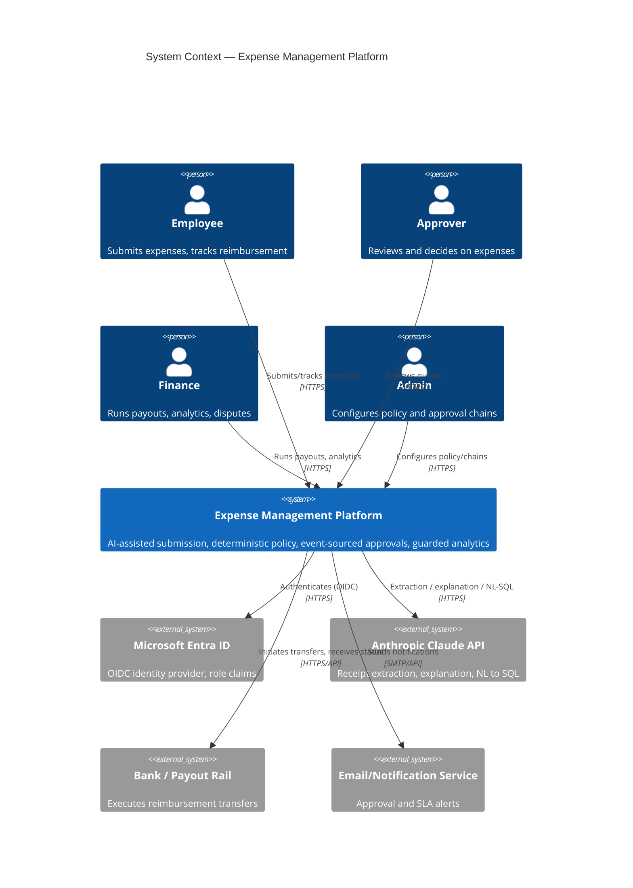
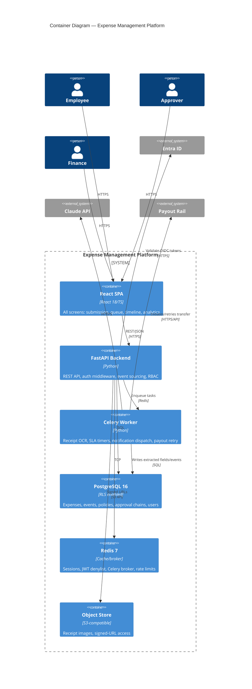
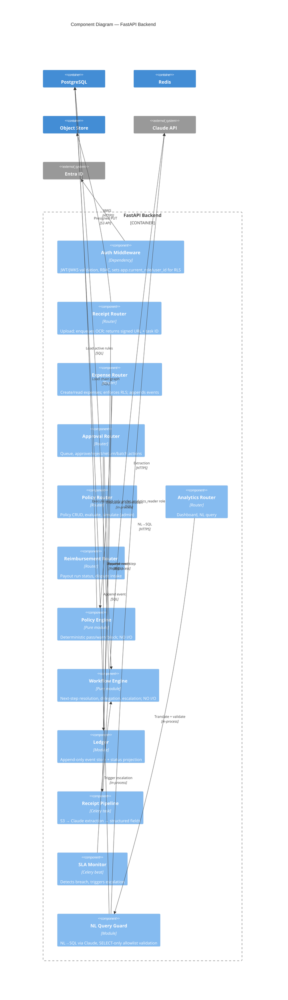

# Solution Architecture — Expense Management & Reimbursement Platform (Pilot)

> **Traceability:** REQ-EXP-1 (submission) · REQ-EXP-2 (approval) · REQ-EXP-3 (policy) ·
> REQ-EXP-4 (status/reimbursement) · REQ-EXP-5 (analytics) · REQ-AUTH-1 (auth/RBAC)

---

## 1. Architecture principles

| Principle | Realisation | Requirement |
|-----------|-------------|-------------|
| AI removes friction; deterministic systems move money | Claude extracts/explains; a pure-function policy engine is sole authority on verdicts; no LLM output writes an approval or payment | REQ-EXP-1, REQ-EXP-3 |
| Event-sourced state, append-only | Every lifecycle transition is an immutable `ExpenseEvent`; current status is a projection | REQ-EXP-2, REQ-EXP-4 |
| RLS-first data isolation | PostgreSQL Row-Level Security enforces role visibility at the DB layer, not just in application code | REQ-AUTH-1 |
| Stateless services (12-Factor) | API instances hold no session state; state lives in Postgres/Redis; config via env vars | NFR — maintainability/scalability |
| Defence in depth | SSO (Entra ID) → JWT validation → RBAC middleware → RLS → audit log | REQ-AUTH-1 |
| Testability | Policy, workflow, and ledger engines are pure functions with no I/O | NFR — maintainability |

---

## 2. Technology stack

| Layer | Technology | Rationale | Decision record |
|-------|-----------|-----------|------------------|
| Frontend | React 18 + TypeScript, Vite | Strict typing, component reuse across 10+ screens | ADR-0001 |
| Backend API | FastAPI (Python, async) | Async-first for OCR/NL pipelines, Pydantic validation, auto-OpenAPI (no contract drift) | ADR-0001 |
| Auth | Microsoft Entra ID (OIDC) + JWKS validation | SSO-first, no password storage, roles from IdP claims | ADR-0001, REQ-AUTH-1 |
| Database | PostgreSQL 16 with Row-Level Security | RLS, JSONB, strong ACID guarantees for financial data | ADR-0001 |
| Cache / broker | Redis 7 | Session/JWT denylist, rate limits, Celery broker | — |
| Object storage | S3-compatible (MinIO for pilot) | Receipt blobs via signed URLs | REQ-EXP-1 |
| AI / LLM | Anthropic Claude (Messages API) | Receipt extraction, plain-language policy explanation, NL→SQL | ADR-0001, REQ-EXP-1, REQ-EXP-3, REQ-EXP-5 |
| Async workers | Celery + Redis broker | Receipt pipeline, SLA timers, notifications | REQ-EXP-1, REQ-EXP-2 |
| Observability | OpenTelemetry + Prometheus | Traces/metrics for pipeline latency and SLA breaches | NFR |

---

## 3. C4 diagrams

### 3.1 Context



### 3.2 Container



### 3.3 Component — FastAPI backend



---

## 4. Core components, contracts, and edge-case resolution

### 4.1 Receipt pipeline — REQ-EXP-1

**Contract:** `POST /receipts` → `{receipt_id, upload_url}`; async `process_receipt(receipt_id)` writes
`{merchant, date, amount, currency, category, line_items[], confidence:{field: 0..1}}` to
`receipts.extracted_fields` (JSONB).

**Edge cases resolved:**
- EC-1.1 Unreadable/low-confidence receipt → `status=manual_entry_required`; original image retained and linked to the expense for approver review (scenario: manual entry).
- EC-1.2 Unsupported file type (e.g. `.exe`) → rejected at upload with the accepted-types list (JPEG/PNG/PDF).
- EC-1.3 File > 10 MB → rejected with a file-size error; no expense created.
- EC-1.4 Duplicate receipt (same merchant/amount/date) → warned before submission; if user proceeds, expense flagged for approver review.
- EC-1.5 Missing required field (amount/date/category/cost centre) → submission blocked per-field with a named-field error.
- EC-1.6 Future-dated expense → submission blocked with an explicit message.
- EC-1.7 Foreign-currency receipt → both original and home-currency amounts stored; conversion rate + its timestamp recorded on the expense.
- EC-1.8 Multi-line expense across cost centres → each line item routes to its own cost centre's chain; overall expense total is the sum.
- EC-1.9 Claude API timeout/error during extraction → Celery retries ×3 exponential backoff; on exhaustion falls into EC-1.1 manual-entry path (never blocks indefinitely).

### 4.2 Policy engine — REQ-EXP-3

**Contract:** `evaluate(expense, rules[]) -> {verdict: pass|warn|block, triggered_rules[], plain_language_explanation}`.
Pure function, no I/O; rules loaded by the caller from the DB and passed in.

**Edge cases resolved:**
- EC-3.1 Block verdict → the LLM never approves or moves money; the deterministic engine is sole authority (non-negotiable control).
- EC-3.2 In-flight expense during a policy republish → continues to be evaluated against its submission-time policy version, held via `expenses.policy_version_id`.
- EC-3.3 New policy version publish → stored with an incremented version number; prior versions retained for audit, never deleted; in-flight expenses unaffected.
- EC-3.4 Missing receipt above the no-receipt threshold → requires a declaration and adds an extra approval step; flags `no-receipt-declared`.
- EC-3.5 Missing receipt below threshold → no declaration required; normal chain.
- EC-3.6 Admin dry-run/simulation against last 30 days → executes against a read-only snapshot; never affects live evaluation.
- EC-3.7 Past effective date on publish → publication rejected; effective date must be today or later.
- EC-3.8 Overlapping general vs. specific rules → most-specific rule wins (e.g. international travel over general travel limit).
- EC-3.9 Currency-specific rule (e.g. EU meal limit in €) → evaluated and explained against the currency-specific limit, not the default.
- EC-3.10 No rule matches an expense → default verdict is `pass`, logged for admin audit (gap visibility, not silent failure).

### 4.3 Workflow engine — REQ-EXP-2

**Contract:** `resolve_next_step(expense_id, chain, events[]) -> {step_id, approver_id, due_date, is_escalation, alternate_approver_id?}`.

**Edge cases resolved:**
- EC-2.1 Risk-sorted queue → AI-flagged items sort before clean items; each flagged item shows its flag reason.
- EC-2.2 Batch approval → all selected clean items move to `approved`; one event recorded per expense (never a single collapsed event).
- EC-2.3 Batch approval containing a flagged item → the flagged item is excluded and reported as requiring individual review; the clean item(s) still approve.
- EC-2.4 Self-approval → blocked; chain auto-routes the step to an alternate approver.
- EC-2.5 Rejection without a comment → blocked until a comment is supplied; with a comment the expense moves to `rejected`.
- EC-2.6 Return for edit → moves to `returned_for_edit`; timeline records the comment; resubmission restarts only remaining chain steps, not steps already approved (replays the event stream to find the first incomplete step).
- EC-2.7 SLA breach with active delegation → escalates to the delegate; escalation event recorded.
- EC-2.8 SLA breach with no delegation → escalates to the next node up the reporting chain; original approver notified.
- EC-2.9 Approver deactivated mid-chain → step reassigned to designated backup/manager; reassignment recorded on the timeline.
- EC-2.10 Concurrent approve/reject on the same step → only the first recorded decision applies (optimistic lock on `expense.version`); the second actor is told the step was already resolved (HTTP 409).
- EC-2.11 Single-step chain → sole approval moves the expense directly to `approved`.

### 4.4 Ledger / event store — REQ-EXP-4

**Contract:** append-only `expense_events`; current status is a write-through projection of the
last event in the ordered stream (see ADR for full rationale — this pilot's ADR-0001 below focuses
on the AI boundary and stack; the event-sourcing rationale is captured as a follow-on ADR).

**Edge cases resolved:**
- EC-4.1 Every transition appends an event with actor, timestamp, description; timeline is human-readable and updates immediately on transition.
- EC-4.2 Predicted payout date on `approved` expenses is clearly labelled an estimate, not a guarantee.
- EC-4.3 Finance batch payout → each expense moves to `reimbursed`; timeline shows the payout reference.
- EC-4.4 Dispute raised from timeline → routes to the finance queue with full event history; expense moves to `disputed`.
- EC-4.5 Partial reimbursement → distinct `partially_reimbursed` status; timeline shows amount paid vs. outstanding.
- EC-4.6 Reimbursement failure → `reimbursement_failed` event recorded with reason; retry that later succeeds appends `reimbursed`; expense never silently remains `approved`.
- EC-4.7 Cross-user timeline access → denied with HTTP 403 unless caller is the owner, their approver, or finance.
- EC-4.8 Direct modification of a past event → rejected; corrections only via a new compensating event (append-only enforced at the DB role/RLS level, not just in application code).

### 4.5 Analytics engine — REQ-EXP-5

**Contract:** `POST /analytics/query {question} -> {sql_used, rows[], confidence}`; dashboard endpoints
are pre-aggregated views.

**Edge cases resolved:**
- EC-5.1 Company-wide dashboard → totals by category/cost-centre/team plus anomaly alerts (finance role only).
- EC-5.2 NL query → compiled to an allowlisted, read-only SQL statement; aggregated results only, no per-employee PII fields exposed.
- EC-5.3 Ambiguous/unsafe NL query → low-confidence fallback returns a canned report; unrestricted SQL is never executed.
- EC-5.4 NL query phrased as a write/delete request → refused outright; only read-only aggregate queries are ever executed (defence independent of the LLM's own judgement — the guard enforces this, not the prompt).
- EC-5.5 Employee calling finance analytics endpoints → denied with HTTP 403.

### 4.6 Authentication & RBAC — REQ-AUTH-1

**Edge cases resolved:**
- EC-A.1 SSO login via Entra ID → no password stored; role assigned from IdP claims.
- EC-A.2 Demo auth fallback (no production tenant in pilot) → role explicitly mapped for the demo; session clearly marked as non-production auth.
- EC-A.3 Employee listing expenses → sees only their own (RLS).
- EC-A.4 Approver queue → sees only items awaiting their action (RLS + workflow state).
- EC-A.5 Finance listing expenses → sees all (RLS role bypass for `finance`/`admin`).
- EC-A.6 Expired session → redirected to re-authenticate; no action taken on the user's behalf until re-authenticated.
- EC-A.7 Deactivated account → access denied with a message directing to an administrator.
- EC-A.8 Role change mid-session → new permissions apply only from the next login; prior session's permissions are not retroactively altered (JWT is not re-validated against live IdP state mid-session by design — a session carries the role claim it was issued with).

---

## 5. Security architecture

```
[Browser] --OIDC PKCE--> [Entra ID] --id_token(roles)--> [Auth Middleware]
                                                              │ JWT/JWKS validation, RBAC
                                                              ▼
                                                     [PostgreSQL RLS] (defence in depth)
```

**Role matrix**

| Role | Own expenses | Approval queue | Reimbursements | Analytics | Admin |
|------|--------------|-----------------|-----------------|-----------|-------|
| employee | CRUD own | — | own status only | own only | — |
| approver | read own | assigned queue only | — | own team | — |
| finance | read all | — | all | all | — |
| admin | read all | — | — | all | full (policy/chains) |

**AI boundary rule (non-negotiable):** Claude outputs never trigger a financial write, approval
state change, or reimbursement action directly. Every AI output is a suggestion (receipt fields),
an explanation (policy text), or a translation (NL→SQL) that a human confirms or a deterministic
guard validates before any state change (REQ-EXP-1, REQ-EXP-3, REQ-EXP-5). See ADR-0001.

**OWASP Top 10:2025 controls**

| Threat | Control |
|--------|---------|
| Broken access control | RBAC middleware + PostgreSQL RLS at the DB layer |
| Injection | Parameterised queries; NL→SQL output parsed and allowlist-validated, never string-concatenated |
| Cryptographic failure | TLS 1.3 in transit; SSE at rest; no password storage (SSO-only) |
| Insecure design | Pure-function policy/workflow engines; AI boundary enforced architecturally, not by prompt alone |
| Security misconfiguration | Secrets via env/Vault; RLS enable flag verified by an integration test gate before deploy |
| SSRF | Server-side signed URLs only; no user-supplied URL fetch |

---

## 6. Quality attribute targets (ISO/IEC 25010)

| Attribute | Target | Mechanism |
|-----------|--------|-----------|
| Performance | Receipt extraction p95 < 8s; API p95 < 200ms | Async pipeline, indexed hot paths |
| Reliability | Payout retries with reason recorded; never silent stuck state | `reimbursement_failed` event + retry (EC-4.6) |
| Security | Zero direct DB writes from AI output | AI boundary rule + guard modules |
| Maintainability | Policy/workflow engines 100% pure, unit-testable | No I/O in core engines |
| Scalability | Stateless API, horizontally scalable workers | Redis broker, queue-depth scaling |
| Auditability | Every transition attributable, append-only | Event-sourced ledger (EC-4.8) |

---

## 7. Edge case register (consolidated)

All edge cases enumerated in §4 are consolidated here for quick review; each traces to its
requirement and owning component.

| ID | Requirement | Component | One-line resolution |
|----|-------------|-----------|----------------------|
| EC-1.1..1.9 | REQ-EXP-1 | Receipt Pipeline | See §4.1 |
| EC-3.1..3.10 | REQ-EXP-3 | Policy Engine | See §4.2 |
| EC-2.1..2.11 | REQ-EXP-2 | Workflow Engine | See §4.3 |
| EC-4.1..4.8 | REQ-EXP-4 | Ledger | See §4.4 |
| EC-5.1..5.5 | REQ-EXP-5 | Analytics Engine | See §4.5 |
| EC-A.1..A.8 | REQ-AUTH-1 | Auth Middleware / RLS | See §4.6 |

## 8. Traceability summary

Every component and edge case above cites its owning `REQ-*` ID inline. Interface contracts are
locked in `staging/artifacts/contracts/api-spec.yaml`. Significant decisions (AI boundary, stack
choice) are recorded in `staging/decisions/ADR-0001-ai-boundary-and-stack.md`.
